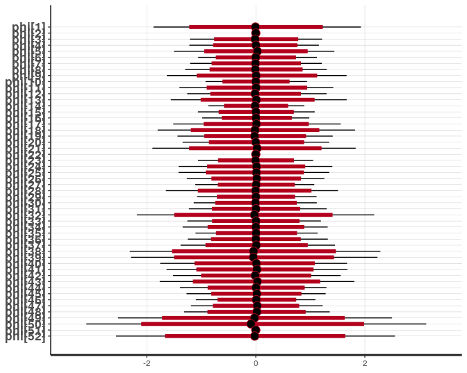
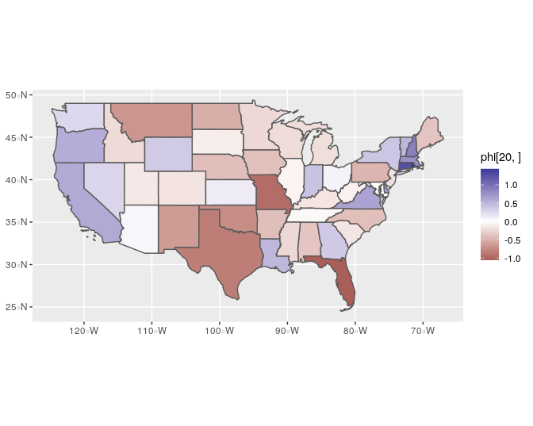
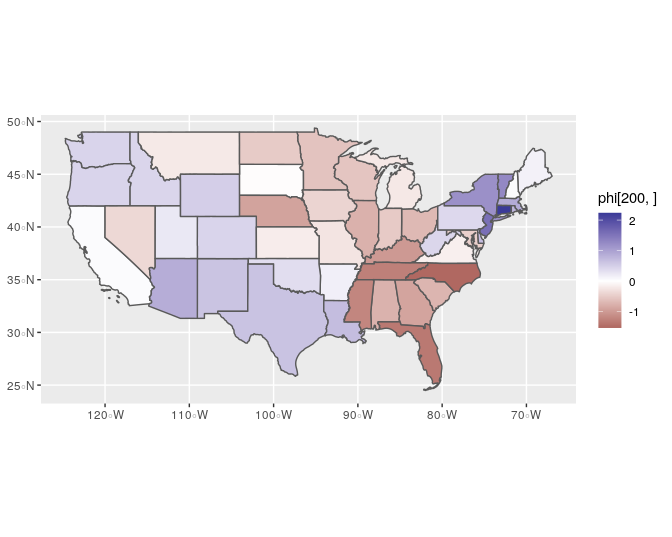
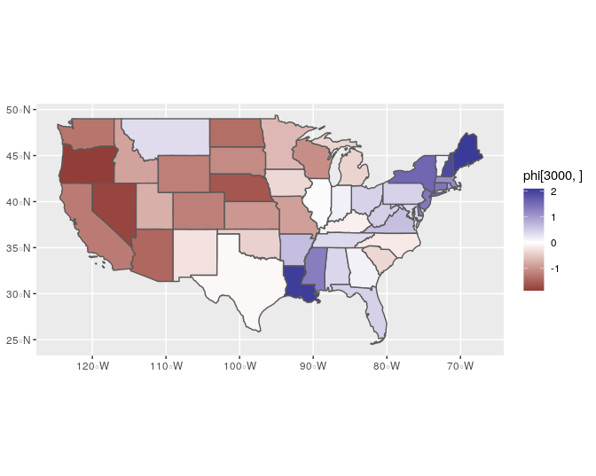
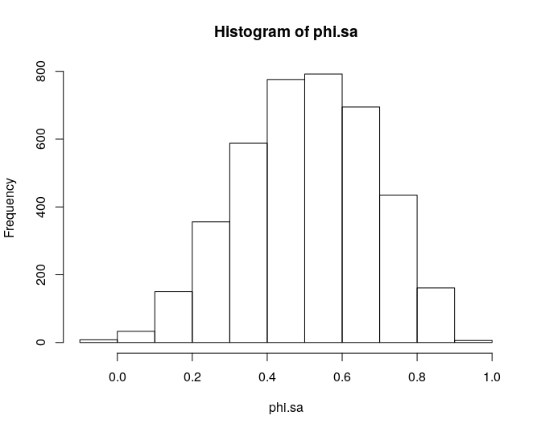

<!-- README.md is generated from README.Rmd. Please edit that file -->
Fitting IAR/BYM2 models in Stan with disconnected graph structures
------------------------------------------------------------------

This repo contains R and Stan code to fit spatial models using intrinsic
autoregressive priors, with or without a fully connected graph structure
(i.e. islands and multiple disconnected regions are accepted). It builds
on earlier work by [Mitzi
Morris](https://github.com/stan-dev/example-models/blob/master/knitr/car-iar-poisson/nb_data_funs.R)
and [Adam
Howes](https://athowes.github.io/2020/11/10/fast-disconnected-car/) with
some slight differences. The method here avoids any shuffling of
observations in R; and here the BYM2 model (which does partial pooling
across neighboring observations using parameter *ϕ*, and across all
observations using *θ*) *ϕ*<sub>*i*</sub> gets zeroed out for any
islands or other observations with zero neighbors.

For an introduction to these models see Morris’ [Stan case
study](https://mc-stan.org/users/documentation/case-studies/icar_stan.html).

### Stan code

The intrinsic autoregressive prior is programmed following Morris et
al. 2020:

``` cpp
functions {
/**
  * intrinsic autoregressive prior (Morris et al 2019)
  * @return lpdf of IAR prior minus any constant terms
  */
  real icar_normal_lpdf(vector phi, int N, int[] node1, int[] node2) {
    return -0.5 * dot_self(phi[node1] - phi[node2]) +
      normal_lpdf(sum(phi) | 0, 0.001 * N);
  }
}
```

It can be broken into two parts: first the pairwise difference formula
`-0.5 * dot_self(phi[node1] - phi[node2])` which places low (prior)
probability on large differences between neighbors, and then the
sum-to-zero constraint `sum(phi) ~ normal(0, 0.001*N)`.

It needs to be applied independently to each group of connected
observations and islands may need some kind of special treatment. If
there were no partial-pooling across all observations (i.e. there were
no *θ*, just *ϕ*) we could follow what others have done and set the
prior distributions for the islands to *ϕ*<sub>*i*</sub> ∼ *N*(0, 1).
But with the BYM2 that will end up duplicating *θ*<sub>*i*</sub>.
Instead, we’ll zero out *ϕ*<sub>*i*</sub> for any islands.

First we’ll take Adam Howe’s observation that the following code chunk
already drops out the islands, so it can remain as is:

``` cpp
target += -0.5 * dot_self(phi[node1] - phi[node2]);
```

Only connected nodes are in those indices.

Now we just need to add the sum-to-zero constraint, which again happens
to take care of our island issue naturally. The data `group_idx` allows
us to extract index observations by group; and we pull those indices out
using Stan’s `segment` function. If the `group_size` is one (an island),
this gives it the strong prior distribution we need to zero it out (and
we might add an extra zero to the scale, `0.0001`):

``` cpp
  int pos;
  pos = 1;
  for (j in 1:k) {
    sum(phi[segment(group_idx, pos, group_size[j])]) ~ normal(0, 0.001 * group_size[j]);
    pos = pos + group_size[j];
  }
```

Then the full model in `BYM2.stan` is below, which will work with or
without a fully connected graph structure and doesn’t require any
reshuffling of observations. It requires needs the following input:

-   `n` number of observations
-   `k` number of groups of connected observations (i.e. a connected
    graph with one disconnected island has `k=1`)
-   `group_size` an integer array with the number of observations per
    group
-   `n_edges` total number of edges (sum of all `edge_size`)
-   `node1`, `node2` same as in Morris’ code, these contain the indices
    for each pair of connected nodes
-   `group_idx` integer array (size `n`), see below. Allows us to
    extract observations by their group membership.
-   `scale_factor` vector of scale factors, one per group—but assigned
    to every observations according to group membership
-   `prior_only` Binary indicator, skip the likelihood and just compute
    the prior or sample from posterior distribution given data
-   `y` outcome data (integer array) (ignored if `prior_only=1`)
-   `offset` offset term (gets log transformed internally) (ignored if
    `prior_only=1`)

``` stan
// BYM2 model with possibly disconnected group structure and islands
data {
  int n;    // no. observations
  int k;    // no. groups
  int group_size[k]; // group sizes---to extract data by group
  int<lower=0> n_edges; // total number of edges
  int<lower=0> node1[n_edges];
  int<lower=0> node2[n_edges];
  int group_idx[n]; // e.g. phi[group_idx[1:group_size[1]]] contains group 1 outcomes
  vector[n] scale_factor; // will repeat same value for all observations by group;
  int<lower=0, upper=1> prior_only;
  int y[n];
  vector[n] offset;
}

transformed data {
  vector[n] log_off = log(offset);
}

parameters {
  real alpha;
  real<lower=0> sigma_re;
  vector[n] phi;
  vector[n] theta;
  real logit_rho;
}

transformed parameters {
  vector[n] convolved_re;
  real<lower=0, upper=1> rho;
  rho = inv_logit(logit_rho);
  convolved_re = sqrt(rho * inv(scale_factor)) .* phi + sqrt(1 - rho) * theta;      
}

model {
  int pos;
    pos = 1;
    for (j in 1:k) {
      sum(phi[segment(group_idx, pos, group_size[j])]) ~ normal(0, 0.001 * group_size[j]);
      pos = pos + group_size[j];
    }
   target += -0.5 * dot_self(phi[node1] - phi[node2]);
   sigma_re ~ std_normal();
   theta ~ std_normal();
   logit_rho ~ std_normal();
   alpha ~ std_normal();
   if (!prior_only) y ~ poisson_log(log_off + alpha + convolved_re * sigma_re);
}
```

### Demonstration

This demonstrates using all US states (including Puerto Rico and D.C.).

``` r
library(rstan)
rstan_options(auto_write = TRUE)
library(sf)
library(spdep)
library(INLA)
library(ggplot2)
model = stan_model("BYM2.stan")
# load geostan::edges, geostan::shape2mat , geostan::prep_icar_data
source("https://raw.githubusercontent.com/ConnorDonegan/geostan/main/R/convenience-functions.R")
# load get.shp function to download shapefiles
source("https://raw.githubusercontent.com/ConnorDonegan/helpful/master/get-shp.R")
c_scale <- function(C) { # create scale factor for BYM2 model
    # C is N by N connectivity matrix
    N <- nrow(C)
    adj.matrix <- Matrix::Matrix(C, sparse = TRUE)
    Q =  Diagonal(N, rowSums(adj.matrix)) - adj.matrix
    Q_pert = Q + Diagonal(N) * max(diag(Q)) * sqrt(.Machine$double.eps)
    Q_inv = INLA::inla.qinv(Q_pert, constr=list(A = matrix(1,1,N),e=0))
    scale_factor <- exp(mean(log(diag(Q_inv))))
    return (scale_factor)
}
```

Download the shapefile from the Census Bureau and load it as an `sf`
(simple features) object:

``` r
## get a shapefil
url <- "https://www2.census.gov/geo/tiger/GENZ2019/shp/cb_2019_us_state_20m.zip"
#get.shp(url, "states")
states <- st_read("states")
```

    ## Reading layer `cb_2019_us_state_20m' from data source `/home/connor/repo/Stan-IAR/states' using driver `ESRI Shapefile'
    ## Simple feature collection with 52 features and 9 fields
    ## geometry type:  MULTIPOLYGON
    ## dimension:      XY
    ## bbox:           xmin: -179.1743 ymin: 17.91377 xmax: 179.7739 ymax: 71.35256
    ## CRS:            4269

``` r
ggplot(states) +
  geom_sf() +
  theme_void()
```


Get group sizes and build the index for group membership:

``` r
## create a list of neighbors based on contiguity (shared borders)
nb <- spdep::poly2nb(states)
nb2 <- spdep::n.comp.nb(nb)
print(nb2)
```

    ## $nc
    ## [1] 4
    ## 
    ## $comp.id
    ##  [1] 1 2 1 1 1 1 1 1 1 1 1 1 1 1 1 1 1 1 1 1 1 3 1 1 1 1 1 1 1 1 1 1 1 1 1 1 1 1
    ## [39] 1 1 1 1 1 1 1 1 1 1 1 1 4 1

``` r
## make group_idx out of nb2
n <- nrow(states)
k = nb2$nc
group_idx = NULL
for (j in 1:k) group_idx <- c(group_idx, which(nb2$comp.id == j))

print(group_idx)
```

    ##  [1]  1  3  4  5  6  7  8  9 10 11 12 13 14 15 16 17 18 19 20 21 23 24 25 26 27
    ## [26] 28 29 30 31 32 33 34 35 36 37 38 39 40 41 42 43 44 45 46 47 48 49 50 52  2
    ## [51] 22 51

``` r
## group sizes (number of observations per group)
sizes <- NULL
for (j in 1:k) sizes <- c(sizes, sum(nb2$comp.id == j))
print(sizes)
```

    ## [1] 49  1  1  1

``` r
## make edge list 
C <- shape2mat(states, style = "B")
E <- edges(C)
print(head(E))
```

    ##   node1 node2
    ## 1     1    13
    ## 2     1    20
    ## 3     3    24
    ## 4     3    25
    ## 5     3    27
    ## 6     3    29

Or do the same using the `prep_icar_data` function:

``` r
iar.data <- prep_icar_data(C)
```

That function returns a list with everything the `BYM2.stan` model needs
for the IAR component, but it sets the scale factor to 1. That’s okay
but won’t produce the BYM2 model. Add in the scale factor:

``` r
## make scale_factors
scale_factor <- vector(mode = "numeric", length = n)
for (j in 1:k) {
    g.idx <- which(nb2$comp.id == j) 
    if (length(g.idx) == 1) {
        scale_factor[g.idx] <- 1 
        next
    }    
    Cg <- C[g.idx, g.idx] 
    scale.j <- c_scale(Cg)
    scale_factor[g.idx] <- scale.j
}
iar.data$scale_factor <- scale_factor
print(scale_factor)
```

    ##  [1] 0.5250207 1.0000000 0.5250207 0.5250207 0.5250207 0.5250207 0.5250207
    ##  [8] 0.5250207 0.5250207 0.5250207 0.5250207 0.5250207 0.5250207 0.5250207
    ## [15] 0.5250207 0.5250207 0.5250207 0.5250207 0.5250207 0.5250207 0.5250207
    ## [22] 1.0000000 0.5250207 0.5250207 0.5250207 0.5250207 0.5250207 0.5250207
    ## [29] 0.5250207 0.5250207 0.5250207 0.5250207 0.5250207 0.5250207 0.5250207
    ## [36] 0.5250207 0.5250207 0.5250207 0.5250207 0.5250207 0.5250207 0.5250207
    ## [43] 0.5250207 0.5250207 0.5250207 0.5250207 0.5250207 0.5250207 0.5250207
    ## [50] 0.5250207 1.0000000 0.5250207

And then append to the `iar.data` list any other required data:

``` r
dl <- list(
    n = n,
    prior_only = TRUE,
    y = rep(1, n), # just a placeholder
    offset = rep(1, n) # placeholder
)
dl <- c(dl, iar.data)

fit = sampling(model,
               data = dl,
               chains = 4,
               cores = 4,
               control = list(max_treedepth = 13)
               )
```

We can see that three of the *ϕ*<sub>*i*</sub> are zero (the
disconnected areas):

``` r
plot(fit, pars = "phi")
```

    ## ci_level: 0.8 (80% intervals)

    ## outer_level: 0.95 (95% intervals)



And we can view a sample of the variety of spatial autocorrelation
patterns that are present in the prior model for *ϕ*:

``` r
drop.idx <- which(states$NAME %in% c("Alaska", "Hawaii", "Puerto Rico"))
cont <- states[-drop.idx, ]
phi <- as.matrix(fit, pars = "phi")[, -drop.idx]

ggplot(cont) +
  geom_sf(aes(fill = phi[1,])) +
  scale_fill_gradient2()
```


``` r
ggplot(cont) +
  geom_sf(aes(fill = phi[20,])) +
  scale_fill_gradient2()
```



``` r
ggplot(cont) +
  geom_sf(aes(fill = phi[200,])) +
  scale_fill_gradient2()
```



``` r
ggplot(cont) +
  geom_sf(aes(fill = phi[3000,])) +
  scale_fill_gradient2()
```



And summarize the degree of spatial autocorrelation in each posterior
draw of *ϕ* with the Moran coefficient:

``` r
phi <- as.matrix(fit, pars = "phi")
w <- shape2mat(states, "W")
phi.sa  <- apply(phi, 1, mc, w = w)
hist(phi.sa)
```


