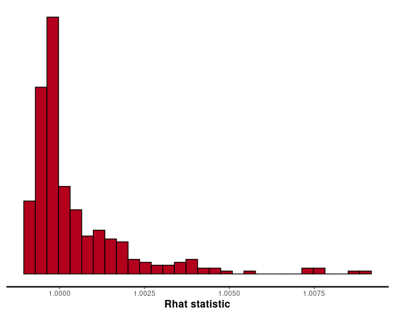
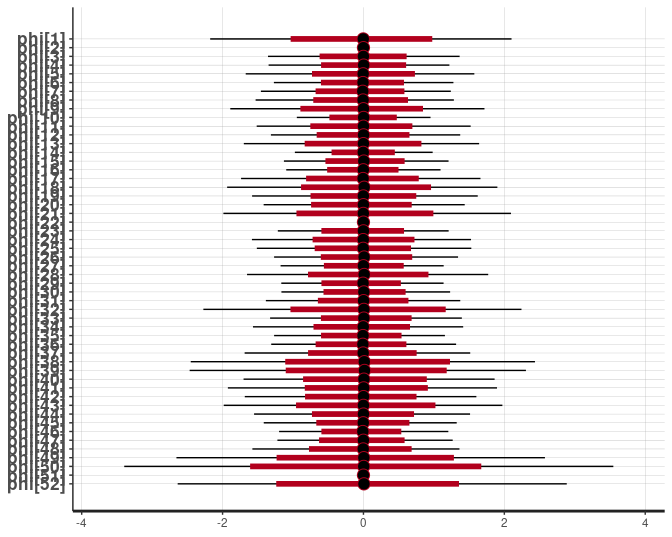
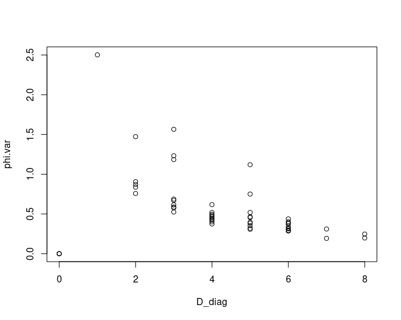
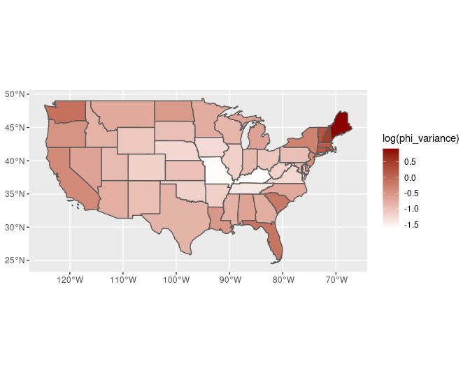
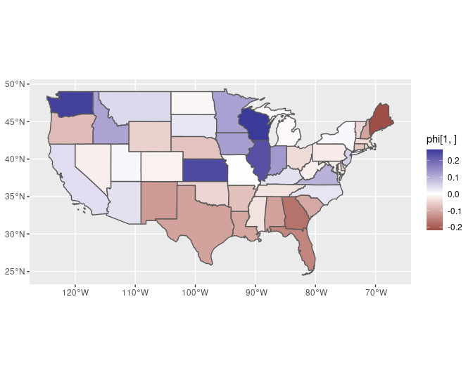
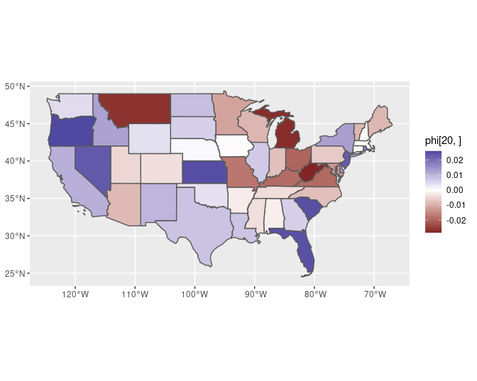
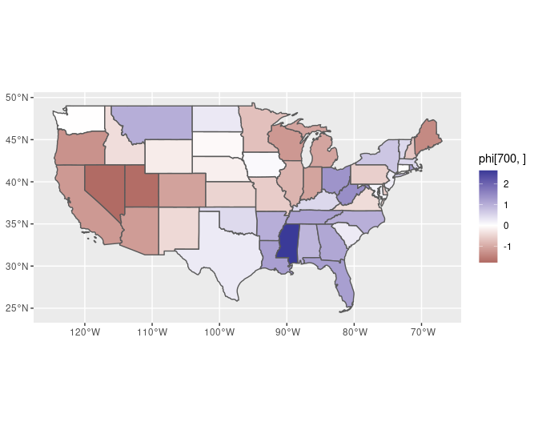

-   [Flexible Functions for ICAR, BYM, and BYM2 Models in
    Stan](#flexible-functions-for-icar-bym-and-bym2-models-in-stan)
    -   [The ICAR prior](#the-icar-prior)
    -   [BYM convolution term](#bym-convolution-term)
    -   [BYM2 convolution term](#bym2-convolution-term)
    -   [Putting it all together](#putting-it-all-together)
    -   [Demonstration](#demonstration)
    -   [Scaling the ICAR prior](#scaling-the-icar-prior)
-   [References](#references)

<!-- README.md is generated from README.Rmd. Please edit that file -->

Flexible Functions for ICAR, BYM, and BYM2 Models in Stan
=========================================================

This repository contains R and Stan code to fit spatial models using
intrinsic conditional autoregressive (ICAR) priors, including the BYM
model (Besag, York, and Mollié 1991) and Riebler et al.’s (2016)
adjustmented (“BYM2”) specification. The code here follows all of the
recommendations from Freni-Sterrantino, Ventrucci, and Rue (2018) for
disconnected graph structures, building on Morris et al. (2019).

The implementation here is designed to be fairly simple given the R and
Stan functions provided here. The code will work if you have a single
connected graph structure, and if there are islands and/or multiple
connected components it will automatically make the appropriate
adjustments.

Contents includes:

-   `icar-functions.stan` Stan functions for calculating log probability
    of the ICAR prior, and functions to create the BYM(2) convolution
    term;
-   `icar-functions.R` R functions to prepare data for the ICAR Stan
    models;
-   `BYM.stan` Example code for the BYM model. Corresponding R code is
    provided in this README.md file;
-   `BYM2.stan` Example code for the BYM2 model;
-   `demo-BYM2.R` Example R code for fitting the BYM2 model.
-   `BYM2-b.stan` Alternative code for the ICAR/BYM2 model in Stan
    (courtesy of Mizi Morris–this is currently under revision, please
    use `BYM2.stan` for now).

The foundation for the efficient Stan code for ICAR models was first
presented in Morris’ Stan [case
study](https://github.com/stan-dev/example-models/blob/master/knitr/car-iar-poisson/nb_data_funs.R)
and Morris et al. (2019). I’ve adapted the model to handle a variety of
common scenarios, particularly the presence of observations with zero
neighbors or data from multiple regions that are disconnected from each
other. These situations impact how the sum-to-zero constraint is imposed
on the model as well as how the terms of the BYM model can be combined.
I drew on previous work by [Adam
Howes](https://athowes.github.io/2020/11/10/fast-disconnected-car/), and
the repository includes additional contributions from M. Morris (where
indicated, carrying over some material from
[Stan-Dev](https://github.com/stan-dev/example-models/tree/master/knitr/car-iar-poisson/update_2021_02)).
I am solely responsible for any errors or oversights here.

For a general introduction to ICAR models (including spatio-temporal
specifications) see Haining and Li (2020). For an introduction to their
implementation in Stan see Morris’ [Stan case
study](https://mc-stan.org/users/documentation/case-studies/icar_stan.html).
For a deeper read see Rue and Held (2005).

### The ICAR prior

The ICAR prior specified with a binary connectivity matrix reduces to a
function of the pairwise differences of neighboring values under the
constraint that the parameter vector sums to zero. Morris et al. program
the ICAR prior in Stan using the following function:

``` stan
/**
  * intrinsic autoregressive prior 
  * @return lpdf of IAR prior minus any constant terms
  */
  real icar_normal_lpdf(vector phi, int N, int[] node1, int[] node2) {
    return -0.5 * dot_self(phi[node1] - phi[node2]) +
      normal_lpdf(sum(phi) | 0, 0.001 * N);
  }
```

where `phi` is the `N`-length vector of parameters to which the ICAR
prior is assigned. `node1` and `node2` contain the indices of each pair
of connected nodes. It is simplified by keeping the ICAR prior on unit
scale. So instead of assigning the prior directly to `phi`, the ICAR
prior is assigned to a vector of standard normal deviates `phi_tilde`;
then `phi = phi_tilde * phi_scale` gets passed into the linear predictor
of the model.

This function contains two restrictions. The first is that the
connectivity structure must consist of binary entries only (ones for
neighboring observations, zero otherwise).

The second restriction is that the graph structure needs to be fully
connected. For graph structures that are not fully connected, the sum to
zero constraint needs to be applied to each connected region separately;
as a result, it is best for each connected component to have its own
intercept.

Finally, the ICAR prior is typically used in conjunction with a
spatially unstructured term `theta` to capture variation around the
local mean (the local mean being modeled by `phi`.) The BYM model
consists of the combination of local and global partial-pooling
(so-called random effects terms). This is refered to as the convolution
term, `convolution = phi + theta`.

The following Stan function calculates the log probability of the ICAR
prior, adjusting as needed for use with the BYM model. In short,
observations with zero neighbors will be handled differently depending
on the inclusion of `theta`; if the model has `theta`, then those `phi`
values need to drop out. If the model does not have `theta`, this code
assigns to the zero-neighbor observations an independent Gaussian prior
with scale equal to `phi_scale`.

``` stan
/**
 * Log probability of the intrinsic conditional autoregressive (ICAR) prior,
 * excluding additive constants. 
 *
 * @param phi Vector of parameters for spatial smoothing (on unit scale)
 * @param spatial_scale Scale parameter for the ICAR model
 * @param node1 
 * @param node2
 * @param k number of groups
 * @param group_size number of observational units in each group
 * @param group_idx index of observations in order of their group membership
 * @param has_theta If the model contains an independent partial pooling term, phi for singletons can be zeroed out; otherwise, they require a standard normal prior. Both BYM and BYM2 have theta.
 *
 * @return Log probability density of ICAR prior up to additive constant
 **/
real icar_normal_lpdf(vector phi, real spatial_scale,
              int[] node1, int[] node2, 
              int k, int[] group_size, int[] group_idx,
              int has_theta) {
  real lp;
  int pos=1;
  lp = -0.5 * dot_self(phi[node1] - phi[node2]);
  if (has_theta) {
    for (j in 1:k) {
      /* sum to zero constraint for each connected group; singletons zero out */
      lp += normal_lpdf(sum(phi[segment(group_idx, pos, group_size[j])]) | 0, 0.001 * group_size[j]);
      pos += group_size[j];
    }
  } else {
    /* does not have theta */
    for (j in 1:k) {
      if (group_size[j] > 1) {
    /* same as above for non-singletons: sum to zero constraint */
    lp += normal_lpdf(sum(phi[segment(group_idx, pos, group_size[j])]) | 0, 0.001 * group_size[j]);
      } else {
    /* its a singleton: independent Gaussian prior on phi */
    lp += normal_lpdf(phi[ segment(group_idx, pos, group_size[j]) ] | 0, spatial_scale);
      }      
      pos += group_size[j];
    }
  }
  return lp;
}
```

Riebler et al. (2016) proposed an adjustment to the ICAR model to enable
more meaningful priors to be placed on `phi_scale`. The idea is to
adjust the scale of `phi` for the additional variance present in the
covariance matrix of the ICAR model, relative to a covariance matrix
with zeroes on the off-diagonal elements. This is introduced through a
`scale_factor` term, which we will code as
`inv_sqrt_scale_factor = sqrt(1/scale_factor)` (to relate this directly
to other implementations you may find).

The following function is used to combine `phi_tilde` with `phi_scale`
as well as the `scale_factor` (which may be a vector ones, to be
ignored).

``` stan
/**
 * Create phi from phi_tilde, inv_sqrt_scale_factor, and spatial_scale. 
 *
 * @param phi_tilde local component (spatially autocorrelated) 
 * @param phi_scale scale parameter for phi
 * @param inv_sqrt_scale_factor The scaling factor for the ICAR variance (see scale_c R function, using R-INLA); 
 *                              transformed from 1/scale^2 --> scale. Or, a vector of ones.
 * @param n number of spatial units
 * @param k number of connected groups
 * @param group_size number of observational units in each group
 * @param group_idx index of observations in order of their group membership
 *
 * @return phi vector of spatially autocorrelated coefficients
 */
vector make_phi(vector phi_tilde, real phi_scale,
              vector inv_sqrt_scale_factor,
              int n, int k,
              int[] group_size, int[] group_idx
              ) {
  vector[n] phi;
  int pos=1;
  for (j in 1:k) {
      phi[ segment(group_idx, pos, group_size[j]) ] = phi_scale * inv_sqrt_scale_factor[j] * phi_tilde[ segment(group_idx, pos, group_size[j]) ];
    pos += group_size[j];
  }
  return phi;
}
```

One way this model can be extended is by assigning a separate scale
parameters for each connected component of the graph. Once you assign
separate intercepts and scale parameters for each disconnected region,
you have independent prior models for each region. Imposing the
constraint that disconnected regions have the same scale parameter may
seem unreasonable for some applications, and also may slow down
sampling. For example, why would the spatial autocorrelation parameters
for the counties of Hawaii have the same scale as those for the
continental U.S.?

Implementing this extension requires declaring
`vector<lower=0>[1+m] phi_scale` in the parameters block and then
adjusting the `make_phi` function as follows:

``` r
phi[ segment(group_idx, pos, group_size[j]) ] = phi_scale[j] * inv_sqrt_scale_factor[j] * phi_tilde[ segment(group_idx, pos, group_size[j]) ];`.
```

The `icar-functions.stan` file contains a function called `make_phi2`
with that adjustment made.

### BYM convolution term

The BYM model includes the parameter vector assigned the ICAR prior plus
a vector `theta` assigned a normal prior with unknown scale:
*θ* ∼ *N*(0, *η*), with *η* assigned some prior such as *η* ∼ *N*(0, 1).
Again, in practice we assign `theta_tilde` a standard normal prior and
then multiply it by its scale `theta_scale`. Then the convolution term
is

``` r
convolution = phi + theta = phi_tilde * spatial_scale + theta_tilde * theta_scale
```

or optionally with the scaling factor:

``` r
convolution = phi_tilde * inv_sqrt_scale_factor * spatial_scale + theta_tilde * theta_scale
```

The following function combines terms to create the BYM convolution
term, making adjustments as needed for disconnected graph structures and
observations with zero neighbors. The input for `phi` should be the
parameter vector returned by `make_phi` (as demonstrated below).

``` stan
/**
 * Combine local and global partial-pooling components into the convolved BYM term.
 *
 * @param phi spatially autocorrelated component (not phi_tilde!)
 * @param theta global component (not theta_tilde!)
 * @param n number of spatial units
 * @param k number of connected groups
 * @param group_size number of observational units in each group
 * @param group_idx index of observations in order of their group membership
 *
 * @return BYM convolution vector
 */
vector convolve_bym(vector phi, vector theta,
              int n, int k,
              int[] group_size, int[] group_idx
              ) {
  vector[n] convolution;
  int pos=1;
  for (j in 1:k) {
     if (group_size[j] == 1) {
        convolution[ segment(group_idx, pos, group_size[j]) ] = theta[ segment(group_idx, pos, group_size[j]) ];
    } else {
    convolution[ segment(group_idx, pos, group_size[j]) ] =
      phi[ segment(group_idx, pos, group_size[j]) ] + theta[ segment(group_idx, pos, group_size[j]) ];
  }
      pos += group_size[j];
  }
  return convolution;
}
```

### BYM2 convolution term

Riebler et al. (2016) also proposed to combine `theta` with `phi` using
a mixing parameter `rho` and a single scale `spatial_scale`, such that

``` r
convolution = spatial_scale * (sqrt(rho * scale_factor^-1) * phi + sqrt(1 - rho) * theta)
```

The following function creates the convolution term for the BYM2 model
and makes adjustments for disconnected graph structures and
zero-neighbor observations. If you use this function, do not also use
the `make_phi` function (see `BYM2.stan`).

``` stan
/**
 * Combine local and global partial-pooling components into the convolved BYM2 term.
 *
 * @param phi_tilde local (spatially autocorrelated) component
 * @param theta_tilde global component
 * @param spatial_scale scale parameter for the convolution term
* @param inv_sqrt_scale_factor The scaling factor for the ICAR variance (see scale_c R function, using R-INLA); 
 *                              transformed from 1/scale^2 --> scale. Or, a vector of ones.
 * @param n number of spatial units
 * @param k number of connected groups
 * @param group_size number of observational units in each group
 * @param group_idx index of observations in order of their group membership
 * @param logit_rho proportion of convolution that is spatially autocorrelated, logit transformed
 *
 * @return BYM2 convolution vector
 */
vector convolve_bym2(vector phi_tilde, 
          vector theta_tilde,
          real spatial_scale,
          vector inv_sqrt_scale_factor,
              int n, 
              int k,
              int[] group_size, 
              int[] group_idx,
              real rho
              ) {
  vector[n] convolution;
  int pos=1;
  for (j in 1:k) {
    if (group_size[j] == 1) {
        convolution[ segment(group_idx, pos, group_size[j]) ] = spatial_scale * theta_tilde[ segment(group_idx, pos, group_size[j]) ];
    } else {
    convolution[ segment(group_idx, pos, group_size[j]) ] = spatial_scale * (
     sqrt(rho) * inv_sqrt_scale_factor[j] * phi_tilde[ segment(group_idx, pos, group_size[j]) ] +
     sqrt(1 - rho) * theta_tilde[ segment(group_idx, pos, group_size[j]) ]
      );
  }
  pos += group_size[j];
  }
  return convolution;
}
```

All of the Stan functions specified above are stored in the file named
“icar-functions.stan”.

### Putting it all together

The ICAR model requires the following input as data:

-   `n` number of observations
-   `k` number of groups of connected observations (i.e. a connected
    graph with one disconnected island has `k=1`)
-   `group_size` an integer array with the number of observations per
    group
-   `n_edges` total number of edges (sum of all `edge_size`)
-   `node1`, `node2` these contain the indices for each pair of
    connected nodes
-   `group_idx` integer array (size `n`), see below. Allows us to
    extract observations by their group membership
-   `inv_sqrt_scale_factor` a k-length vector of scale factors, one per
    connected group. Or, a k-length vector of ones.
-   `m` number of connected graph components requiring their own
    intercept
    -   for a single fully connected graph, this is zero; add one to `m`
        for each additional connected component with `group_size > 1`.
-   `A` an `n` by `m` matrix of dummy variables indicating to which
    connected component an observation belongs (for any extra
    intercepts).

The demonstration shows how to use some R code to very easily obtain all
these items at once. The Stan code appears more complicated than some
applications will require, but it is designed to function under a
variety of common circumstances.

The Stan code below also includes the following terms, just to provide a
complete example:

-   `prior_only` Binary indicator, skip the likelihood and just compute
    the prior or sample from posterior distribution given data
-   `y` outcome data (integer array) (ignored if `prior_only=1`)
-   `offset` offset term (ignored if `prior_only=1`).

This is for the BYM model:

``` stan
// The BYM model //
functions {
#include icar-functions.stan
}
data {
  int n;    // no. observations
  int<lower=1> k; // no. of groups
  int group_size[k]; // observational units per group
  int group_idx[n]; // index of observations, ordered by group
  int<lower=0> m; // no of components requiring additional intercepts
  matrix[n, m] A; // dummy variables for any extra graph component intercepts
  int<lower=1> n_edges; 
  int<lower=1, upper=n> node1[n_edges];
  int<lower=1, upper=n> node2[n_edges];
  int<lower=1, upper=k> comp_id[n]; 
  vector[k] inv_sqrt_scale_factor; // can be a vector of ones, as a placeholder
  int<lower=0, upper=1> prior_only;
  int y[n];
  vector[n] offset; // e.g., log of population at risk
}

transformed data {
  int<lower=0,upper=1> has_theta=1;
}

parameters {
  real alpha;
  vector[m] alpha_phi;
  vector[n] phi_tilde;
  real<lower=0> spatial_scale;
  vector[n] theta_tilde;
  real<lower=0> theta_scale;
}

transformed parameters {
  vector[n] phi = make_phi(phi_tilde, spatial_scale, inv_sqrt_scale_factor, n, k, group_size, group_idx);
  vector[n] theta = theta_tilde * theta_scale;
  vector[n] convolution = convolve_bym(phi, theta, n, k, group_size, group_idx);
  vector[n] eta = offset + alpha + convolution;
  if (m) eta += A * alpha_phi;
}

model {
   // keep the following lines as they are:
   phi_tilde ~ icar_normal(spatial_scale, node1, node2, k, group_size, group_idx, has_theta);
   theta_tilde ~ std_normal();
   // the rest of the priors may need to be adjusted for your own model.
   spatial_scale ~ std_normal(); 
   theta_scale ~ std_normal();
   alpha ~ normal(0, 10); // this is the prior for the mean log rate.
   if (m) alpha_phi ~ normal(0, 2);
   if (!prior_only) y ~ poisson_log(eta);
}
```

R code to run the BYM2 model is in the `BYM2.stan` file.

### Demonstration

This section demonstrates how to fit these models using all US states
(including Puerto Rico and D.C.) It requires some functions from
`icar-functions.R` in this repository, plus the **spdep**, **sf**,
**rstan**, and **ggplot2** packages.

``` r
pkgs <- c("rstan", "sf", "spdep", "ggplot2")
lapply(pkgs, require, character.only = TRUE)
```

    ## [[1]]
    ## [1] TRUE
    ## 
    ## [[2]]
    ## [1] TRUE
    ## 
    ## [[3]]
    ## [1] TRUE
    ## 
    ## [[4]]
    ## [1] TRUE

``` r
rstan_options(auto_write = TRUE)
source("icar-functions.R")
```

Download the shapefile from the Census Bureau and load it as an sf
(simple features) object:

``` r
## get a shapefil
url <- "https://www2.census.gov/geo/tiger/GENZ2019/shp/cb_2019_us_state_20m.zip"
get_shp(url, "states")
```

    ## [1] "states/cb_2019_us_state_20m.cpg"           
    ## [2] "states/cb_2019_us_state_20m.dbf"           
    ## [3] "states/cb_2019_us_state_20m.prj"           
    ## [4] "states/cb_2019_us_state_20m.shp"           
    ## [5] "states/cb_2019_us_state_20m.shp.ea.iso.xml"
    ## [6] "states/cb_2019_us_state_20m.shp.iso.xml"   
    ## [7] "states/cb_2019_us_state_20m.shx"

``` r
states <- st_read("states")
```

    ## Reading layer `cb_2019_us_state_20m' from data source `/home/connor/repo/Stan-IAR/states' using driver `ESRI Shapefile'
    ## Simple feature collection with 52 features and 9 fields
    ## geometry type:  MULTIPOLYGON
    ## dimension:      XY
    ## bbox:           xmin: -179.1743 ymin: 17.91377 xmax: 179.7739 ymax: 71.35256
    ## geographic CRS: NAD83

``` r
ggplot(states) +
  geom_sf() +
  theme_void()
```


All of the required data for the ICAR model can be obtained by passing a
connectivity matrix `C` to the `prep_icar_data` function. The
connectivity matrix has a binary coding scheme:

``` r
C <- spdep::nb2mat(spdep::poly2nb(states, queen = TRUE), style = "B", zero.policy = TRUE)
icar.data <- prep_icar_data(C)
```

In practice there will always be additional data to pass in to the Stan
model. Here we append the ICAR data to some fake outcome data, which is
just a placeholder:

``` r
n <- nrow(states)
dl <- list(
    n = n,
    prior_only = TRUE, # ignore the data, sample from the joint prior probability of parameters
    y = rep(1, n), # just a placeholder
    offset = rep(1, n) # placeholder  
)
dl <- c(dl, icar.data)
```

Now we can compile the BYM model code:

``` r
BYM <- stan_model("BYM.stan")
```

and pass our list of data to Stan to sample from the joint prior
distribution of the parameters:

``` r
 fit = sampling(BYM,
                refresh = 0,
                data = dl,
                control = list(max_treedepth = 13)
                )
```

We can see that three of the `phi_i` are zero:

``` r
plot(fit, pars = "phi")
```



Those tightly centered on zero are the states with zero neighbors. They
have no spatial autocorrelation component by definition, so `phi` gets
zeroed out and the convolution term for thos observations is equal to
`theta`.

We also can see that the variance of the prior distribution is uneven
across states. The ICAR model is driven by the pairwise difference
formula, which comes from *ϕ*′(*D* − *W*)*ϕ* where D is a diagonal
matrix and W is the connectivity matrix (with zeros on the diagonal).
Elements on the diagonal of D are equal to the number of neighbors of
each observation. Observations with large numbers of neighbors have
higher precision (lower variance) relative to those with fewer
neighbors. However, the model is a *joint* probability over the
parameter space, so the prior precision of any one parameter is impacted
by the prior precision of its neighbors, and less so by second- and
third-order neighbors, and so on.

We can see that the variance of the prior probability for `phi` is
related to the number of neighbors (D):

``` r
# joint probability of phi, as specified here, is driven by phi'*(D-C)*phi with D a diagonal matrix containing number of neighbors of each observation
D_diag <- rowSums(C)
phi.samples <- as.matrix(fit, pars = "phi")
phi.var <- apply(phi.samples, 2, var)
plot(D_diag, phi.var)
```



And the marginal variances of the ICAR prior exhibit spatial
autocorrelation, with a predictable pattern of higher variance on the
coasts and lower variance inland:

``` r
## drop states with no neighbors
drop.idx <- which(states$NAME %in% c("Alaska", "Hawaii", "Puerto Rico"))
cont <- states[-drop.idx, ]
phi_variance <- phi.var[-drop.idx]

ggplot(cont) +
  geom_sf(aes(fill=log(phi_variance))) +
  scale_fill_gradient(
    low = "white",
    high = "darkred"
  )
```



We can view a sample of the variety of spatial autocorrelation patterns
that are present in the prior model for `phi`:

``` r
## again, drop to the continental states only
phi <- as.matrix(fit, pars = "phi")[, -drop.idx]

ggplot(cont) +
  geom_sf(aes(fill = phi[1,])) +
  scale_fill_gradient2()
```



``` r
ggplot(cont) +
  geom_sf(aes(fill = phi[20,])) +
  scale_fill_gradient2()
```



``` r
ggplot(cont) +
  geom_sf(aes(fill = phi[700,])) +
  scale_fill_gradient2()
```



The following plot is a histogram of the degree of spatial
autocorrelation in each posterior draw of `phi` as measured by the Moran
coefficient:

``` r
phi <- as.matrix(fit, pars = "phi")
phi.sa  <- apply(phi, 1, mc, w = C)
hist(phi.sa)
```



Only positive spatial autocorrelation patterns can be modeled with the
ICAR prior.

### Scaling the ICAR prior

To follow Reibler et al.’s adjustment to the scale of the model, you can
use the INLA R package and the following R code:

``` r
icar.data <- prep_icar_data(C)

## calculate the scale factor for each of k connected group of nodes, using the scale_c function from M. Morris
k <- icar.data$k
scale_factor <- vector(mode = "numeric", length = k)
for (j in 1:k) {
  g.idx <- which(icar.data$comp_id == j) 
  if (length(g.idx) == 1) {
    scale_factor[j] <- 1
    next
  }    
  Cg <- C[g.idx, g.idx] 
  scale_factor[j] <- scale_c(Cg) 
}

## update the data list for Stan
icar.data$inv_sqrt_scale_factor <- 1 / sqrt( scale_factor )
```

This data then gets passed into the data list for `BYM.stan` or
`BYM2.stan` without any other adjustments needed. You can also find
example code for this in the `demo-BYM2.R` script.

<a rel="license" href="http://creativecommons.org/licenses/by-nc/4.0/"></a><br />This
work is licensed under a
<a rel="license" href="http://creativecommons.org/licenses/by-nc/4.0/">Creative
Commons Attribution-NonCommercial 4.0 International License</a>.

References
==========

Besag, Julian, Jeremy York, and Annie Mollié. 1991. “Bayesian Image
Restoration, with Two Applications in Spatial Statistics.” *Annals of
the Institute of Statistical Mathematics* 43 (1): 1–20.

Freni-Sterrantino, Anna, Massimo Ventrucci, and Håvard Rue. 2018. “A
Note on Intrinsic Conditional Autoregressive Models for Disconnected
Graphs.” *Spatial and Spatio-Temporal Epidemiology* 26: 25–34.

Haining, Robert, and Guangquan Li. 2020. *Modelling Spatial and
Spatio-Temporal Data: A Bayesian Approach*. CRC Press.

Morris, Mitzi, Katherine Wheeler-Martin, Dan Simpson, Stephen J Mooney,
Andrew Gelman, and Charles DiMaggio. 2019. “Bayesian Hierarchical
Spatial Models: Implementing the Besag York Mollié Model in Stan.”
*Spatial and Spatio-Temporal Epidemiology* 31: 100301.

Riebler, Andrea, Sigrunn H Sørbye, Daniel Simpson, and Håvard Rue. 2016.
“An Intuitive Bayesian Spatial Model for Disease Mapping That Accounts
for Scaling.” *Statistical Methods in Medical Research* 25 (4): 1145–65.

Rue, Havard, and Leonhard Held. 2005. *Gaussian Markov Random Fields:
Theory and Applications*. CRC press.
